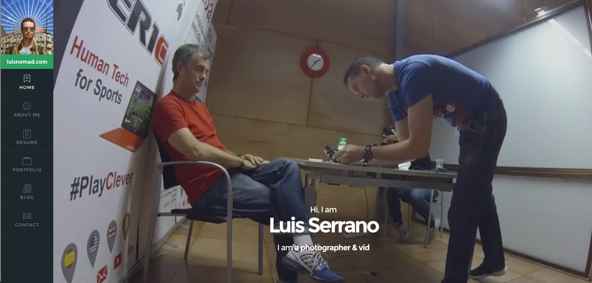

# Empathy Child Theme

This child theme adds some features to the [Empathy Theme](https://themeforest.net/item/empathy-a-vcard-theme/12248701?ref=luissg) by [pixelwars](https://themeforest.net/user/pixelwars)

## Features

* Google Analytics 'ga' variable is updated on page change (you still need to setup Google Analytics with a plugin)
* Background video added

## Instructions

* First you need your purchased copy of the [Empathy Theme](https://themeforest.net/item/empathy-a-vcard-theme/12248701?ref=luissg) installed
* Checkout this project on your themes folder
* Update /js/empathy-child.js and set the videoURL variable to point to any video on YouTube
* Activate the new Empathy Child theme on Wordpress (Dashboard > Appareance > Themes)
* Enjoy

Feel free to fork this child theme. Please let me know if you add more features, so I can use them too :) You can also contribute to this project if you want.

## TODO

* Add Google Analytics snippet without plugins
* Add an Admin page to configure video (select URL, video properties like opacity, etc)
* Center video (looks a little bit cropped on the right)

## Disclaimer

The Empathy theme belongs to Pixelwars, and it's not open source. All rights belong to them, this repository is a small project to add missing features that I wanted to have.
